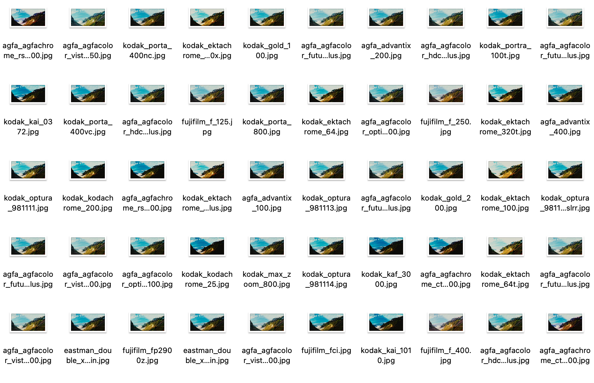

# ColorGradingRenderer

Color grading is a process of picture processing, which improves the presentation on different devices and changes the style of the picture. Essentially, Color Grading is a mapping of colors: *NewColor = f(OrginColor)*, one way to describe such mapping *f* is through a lookup table (LUT). 

This program uses multiple 512*512 LUTs and a single picture and then renders it offscreen. The output results include the processed image with different LUT filters and a JSON description file so that different styles of LUTs can be observed. Our rendering is carried out through OpenGL. At present, it has passed the test on macOS and theoretically supports other platforms (requiring a little adjustment). Feel free to make a pull request.




## Requirement

- C++20 Compiler
- OpenGL 3.3+


## Usage

**Compile**

```bash
git clone https://github.com/ColorsWind/ColorGradingRenderer.git
cd ColorGradingRenderer
cmake .
```


**Process images**

```bash
ColorGradingRenderer \
-filters ~/Filters \
-picture ~/StandardPicture.jpg \
-output ~/output \
-scale 0.3
```


## Algorithm

Suppose $r,g,b\in[0,1]$, let $i=I(b)\in\mathbb R$, which represents given $b$ is corresponding to $i$-th LUT.

Let $\boldsymbol{L}_i(x, y)$ reprensents rgb color in $(x,y)$ of $i$-th LUT, let $lb=\lfloor I(b) \rfloor$, $ub = \lceil I(b) \rceil $, then 
$$
\boldsymbol{f}(r,g,b)=
\frac {I(b) - lb} {ub - lb} \boldsymbol{L}_{lb}(g, b) + 
\frac {I(b) - ub} {lb - ub} \boldsymbol{L}_{ub}(g, b)
$$


http://www.fallenempiredigital.com/blog/2012/12/04/luts-part-1-what-is-a-lut/


  
